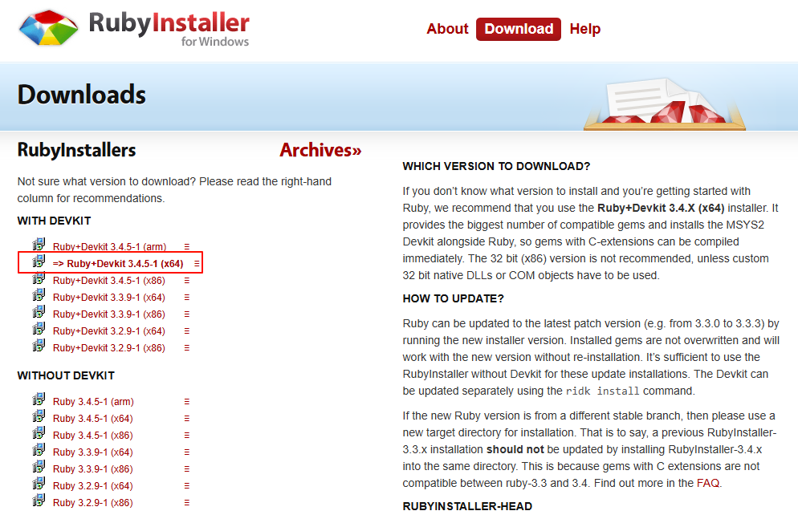

## 搭建步骤

### 安装Docker Desktop
如果是在Windows下的开发环境，建议参考官方指导，安装[Docker Desktop](https://www.docker.com/products/docker-desktop/)，并且在VS CODE中安装Dev Container插件，根据官方模板release的Gemfile，可实现一键配置环境，避免本地安装依赖失败或者卡住的问题（之前本地配置环境一直卡在`gem building native extensions`）。

### 安装Ruby
Ruby是一种Web开发语言，而Gem是Ruby的一个包管理器，功能类似于Python中的Pip

Windows上安装Ruby最简单的方式为RubyInstaller，下载地址为<https://rubyinstaller.org/downloads/>，选择Ruby + Devkit版本即可，安装时需要选择同步安装Toolchain。

<p align="center">
    
</p>

安装完成后，打开cmd输入以下指令即可检查是否成功安装，若安装成功，可返回对应的版本信息
```shell
ruby -v
gem -v
```

### 安装Jekyll

Jekyll是一个强大的静态网站生成器，可以将Markdown、HTML、Liquid模板等文件转换为静态网站。Jekyll支持模板引擎、主题、插件、集成GitHub Pages等特性，可以帮助用户快速搭建和发布静态网站。

Gem安装完成后，打开cmd，输入`gem install jekyll bundler`即可完成Jekyll的安装，检查是否安装成功的方法类似，输入`jekyll -v`即可查看Jekyll的版本号。

### 本地调试

命令行内输入以下命令即可在本地查看渲染后的结果，加上`--livereload`关键字可实时渲染，当`_config.yml`或者模板有变化时，可实时渲染，但是`_posts`里的博客内容似乎不会实时渲染刷新
```shell
bundle exec jekyll serve
bundle exec jekyll serve --livereload  
```

## Markdown常用语法

### 希腊字母语法

| 字母名称 |    大写    | Markdown原文 |    小写    | Markdown原文 |
| :------: | :--------: | :----------: | :--------: | :----------: |
|  Alpha   |  $\Alpha$  |   `\Alpha`   |  $\alpha$  |   `\alpha`   |
|   Beta   |  $\Beta$   |   `\Beta`    |  $\beta$   |   `\beta`    |
|  Gamma   |  $\Gamma$  |   `\Gamma`   |  $\gamma$  |   `\gamma`   |
|  Delta   |  $\Delta$  |   `\Delta`   |  $\delta$  |   `\delta`   |
| Epsilon  | $\Epsilon$ |  `\Epsilon`  | $\epsilon$ |  `\epsilon`  |
|   Zeta   |  $\Zeta$   |   `\Zeta`    |  $\zeta$   |   `\zeta`    |
|   Eta    |   $\Eta$   |    `\Eta`    |   $\eta$   |    `\eta`    |
|  Theta   |  $\Theta$  |   `\Theta`   |  $\theta$  |   `\theta`   |
|   Iota   |  $\Iota$   |   `\Iota`    |  $\iota$   |   `\iota`    |
|  Kappa   |  $\Kappa$  |   `\Kappa`   |  $\kappa$  |   `\kappa`   |
|  Lambda  | $\Lambda$  |  `\Lambda`   | $\lambda$  |  `\lambda`   |
|    Mu    |   $\Mu$    |    `\Mu`     |   $\mu$    |    `\mu`     |
|    Nu    |   $\Nu$    |    `\Nu`     |   $\nu$    |    `\nu`     |
|    Xi    |   $\Xi$    |    `\Xi`     |   $\xi$    |    `\xi`     |
| Omicron  | $\Omicron$ |  `\Omicron`  | $\omicron$ |  `\omicron`  |
|    Pi    |   $\Pi$    |    `\Pi`     |   $\pi$    |    `\pi`     |
|   Rho    |   $\Rho$   |    `\Rho`    |   $\rho$   |    `\rho`    |
|  Sigma   |  $\Sigma$  |   `\Sigma`   |  $\sigma$  |   `\sigma`   |
|   Tau    |   $\Tau$   |    `\Tau`    |   $\tau$   |    `\tau`    |
| Upsilon  | $\Upsilon$ |  `\Upsilon`  | $\upsilon$ |  `\upsilon`  |
|   Phi    |   $\Phi$   |    `\Phi`    |   $\phi$   |    `\phi`    |
|          |            |              | $\varphi$  |  `\varphi`   |
|   Chi    |   $\Chi$   |    `\Chi`    |   $\chi$   |    `\chi`    |
|   Psi    |   $\Psi$   |    `\Psi`    |   $\psi$   |    `\psi`    |
|  Omega   |  $\Omega$  |   `\Omega`   |  $\omega$  |   `\omega`   |

## 参考文献
[1] [使用Jekyll + GitHub Pages搭建个人博客](https://blog.csdn.net/zzy979481894/article/details/132678717)
[2] [Chirpy官方Demo](https://chirpy.cotes.page/posts/getting-started/)
