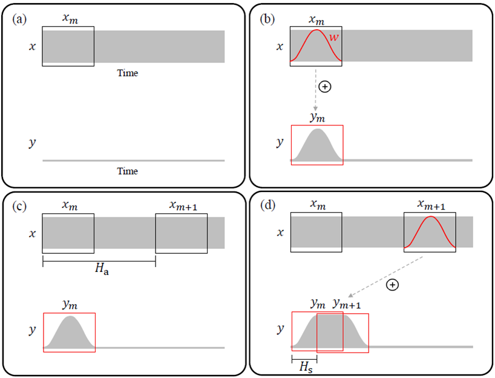
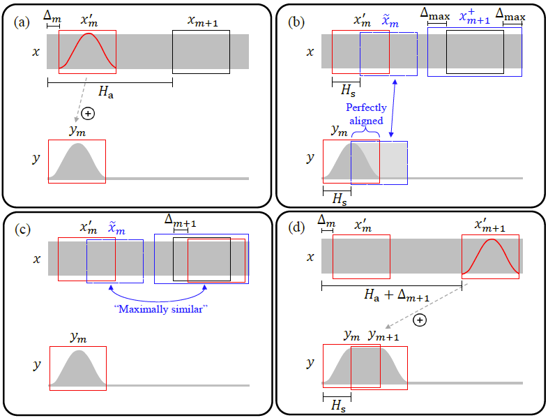
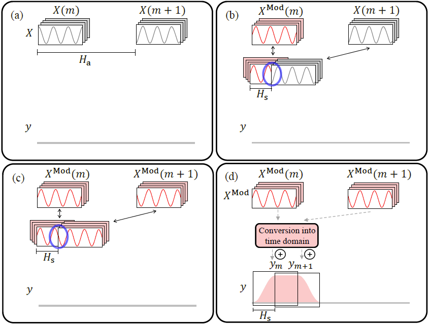

## 算法综述
使用傅里叶变换的方法对音频信号进行变速时，会伴随着音调的改变。为了保持音调不变，需要采用“变速不变调”，即Time Scale Modification (TSM)算法。

### Overlap-add (OLA)

    

如图所示，OLA的算法可以分为以上四步，通常采用`Analysis-Synthesis`处理框架，通过对信号进行加窗，并根据伸缩系数 $H_s$ 选择下一个合成帧，加窗相加合成变速后的信号，通常合成窗的hop size $H_s$ 为窗长的一半。

    

但OLA算法的缺点也很明显，如上图所示，对于周期信号存在一定的破坏性。

### Waveform Similarity Overlap-add (WSOLA)

    

WSOLA算法在OLA算法的基础上，引入了`tolerance`的概念，在 $Δ_{max}$ 的区间范围内，选择一个与 $\widetilde{x}_{m}$ 相似度最大的窗作为下一帧合成帧，可以缓解OLA算法中带来的周期信号破坏负面效果。

    

但WSOLA并不能根治周期的破坏性这一缺陷，此外，对于OLA, WSOLA这一类算法，有可能存在出现“叠音”的情况，如上图所示，尤其是在慢速播放的情况下。

### Phase Vocoder

    

为了彻底解决OLA，WSOLA这一类算法对信号周期的破坏性，基于频域的处理方法应运而生，研究者们提出了Phase Vocoder的方法，与OLA，WSOLA不同的是，Phase Vocoeder并不会抽帧，而是通过修改hop size来实现变速的效果。

    

Phase Vocoder算法的步骤如上所示：
1. 根据伸缩因子 $H_a$ ，计算下一个分析窗 $x(m+1)$ 的傅里叶变换 $X(m+1)$；
2. 计算下一个分析窗与当前合成窗的相位差 $\varphi_{err} = angle(X(m+1)) - angle(X^{mod}(m))$；
3. 使用Phase Vocoder修正 $X(m+1)$ 的相位，得到其新的频域结果 $X^{mod}(m+1)$；
4. 计算 $X^{mod}(m+1)$ 的逆傅里叶变换结果 $y_{m+1}$，加窗相加；

    

其中最核心的步骤为Phase Vocoder的处理，如上图所示，这里有一点比较难理解，**论文中以$t_1$ 时刻对应相位$\varphi_1$为例子，实际上，我们是没法准确地求出一帧中某个点的具体相位的，我们计算的相位是这一帧的相位表示，这个时刻点可以是$t_1$，也可以是这一帧中的其他点，我们最终计算的是保障两帧之间没有相位跳变的瞬时频率，关注的是两帧之间的相位增量，而这也是Phase Vocoder的本质，求两帧间的一个common频率**，详细的算法步骤如下，这里以第 $k$ 个频点为例，实际需要遍历傅里叶变换后的所有频点：
1. 计算出当前分析窗的相位 $\varphi_1 = X(m,k)$；
2. 根据伸缩因子 $H_a$ ，计算出下一个分析窗的相位 $\varphi_2 = X(m+1,K)$ ；
3. 计算两帧分析帧的相位差 $\varphi_{err} = \varphi_1 - \varphi_2$；
4. 计算瞬时频率 $ IF(\omega) = \dfrac{\omega \Delta t + \varphi_{err}}{\Delta t}$ ，其中 $ \Delta t = \dfrac{H_a}{fs}$ ，$\omega$表示角频率，即FFT的分析角频率，$fs$ 表示采样率；
5. 计算合成帧相位 $\varphi_2^{mod} = \varphi_1^{mod} + IF(\omega) * \dfrac{H_s}{fs}$，其中 $\varphi_1^{mod}$ 表示上一帧合成帧的相位；

Phase Vocoder虽然能够从根本上解决帧与帧之间的相位不连续问题，但是对于同一帧内的不同频率，其之间的相对关系可能会被破坏，这种被称为`horizontal phase coherence`，最终产生一种带有混响感的`phaseness`的效果，缓解该效果可以采用`phase lock`的方式，大致的思想如下，找到每一帧中谐振峰的位置，对于其他非谐振峰频率，复用与其最邻近谐振峰的相位变量。

### Harmonic-Percussive Separation (HPS)
基于HPS的算法思想比较简单，通过HPS算法（一般采用中值滤波器）将原始信号分离为冲击信号与谐波信号，对于冲激信号，由于其对相位更不敏感，因此采用OLA算法处理，而对于谐波信号，由于其对相位更加敏感，因此采用对相位破坏更小的Phase Vocoder的方法处理。

### Time-Domain Pitch-Synchronous Overlap and Add (TD-PSOLA)
基于pitch同步的算法一般需要采用一个pitch tracking的模型，大致思想为对每一帧进行pitch分析，通过修改pitch的周期数目来实现变速的效果。

## 参考文献
[1] Driedger J, Müller M. [A review of time-scale modification of music signals](https://www.mdpi.com/2076-3417/6/2/57)[J]. Applied Sciences, 2016, 6(2): 57.
