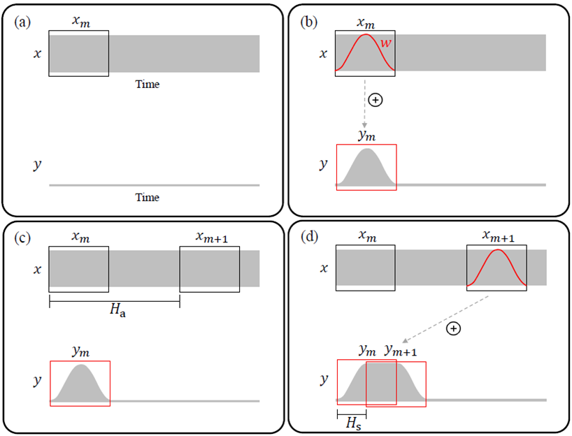
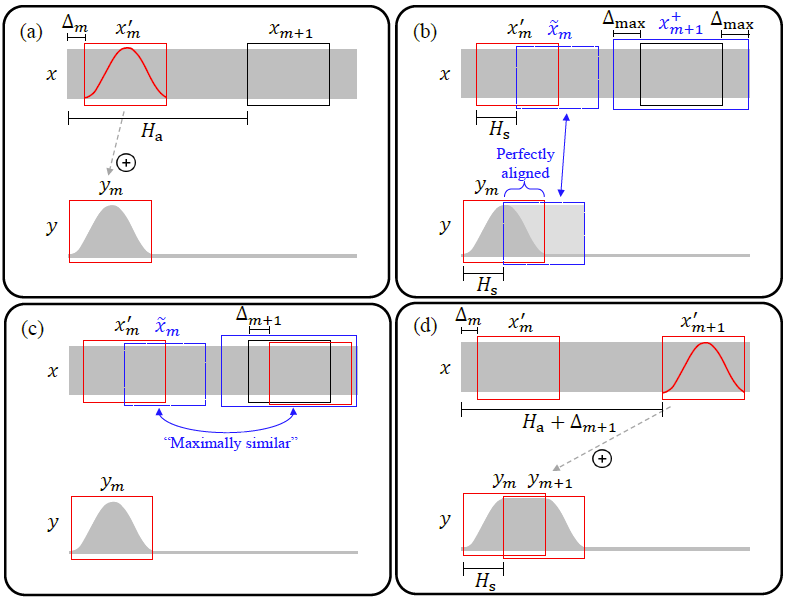
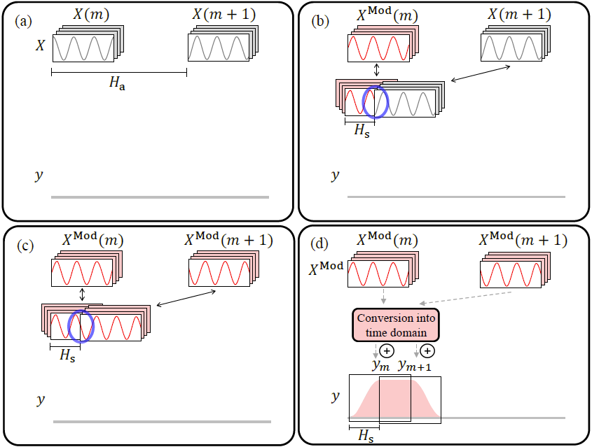

## 算法综述
使用傅里叶变换的方法对音频信号进行变速时，会伴随着音调的改变。为了保持音调不变，需要采用“变速不变调”，即Time Scale Modification (TSM)算法。

### Overlap-add (OLA)

    

如图所示，OLA的算法可以分为以上四步，通常采用`Analysis-Synthesis`处理框架，通过对信号进行加窗，并根据伸缩系数 $H_s$ 选择下一个合成帧，加窗相加合成变速后的信号，通常合成窗的hop size $H_s$ 为窗长的一半。

    

但OLA算法的缺点也很明显，如上图所示，对于周期信号存在一定的破坏性。

### WSOLA (Waveform Similarity Overlap-add)

    

WSOLA算法在OLA算法的基础上，引入了`tolerance`的概念，在 $Δ_{max}$ 的区间范围内，选择一个与 $\widetilde{x}_{m}$ 相似度最大的窗作为下一帧合成帧，可以缓解OLA算法中带来的周期信号破坏负面效果。

    

但WSOLA并不能根治周期的破坏性这一缺陷，此外，对于OLA, WSOLA这一类算法，有可能存在出现“叠音”的情况，如上图所示，尤其是在慢速播放的情况下。

### Phase Vocoder
为了彻底解决OLA, WSOLA这一类算法对信号周期的破坏性，基于频域的处理方法应运而生，研究者们提出了Phase Vocoder的方法。

    

Phase Vocoder算法的步骤如上所示：
1. 根据伸缩因子 $H_a$ ，计算下一个分析窗 $x(m+1)$ 的傅里叶变换 $X(m+1)$；
2. 根据合成窗步长 $H_s$ ，计算下一个分析窗与当前合成窗的相位差 $\varphi_{err} = angle(X(m+1)) - angle(X^{mod}(m))$；
3. 使用Phase Vocoder修正 $X(m+1)$ 的相位，得到其新的频域结果 $X^{mod}(m+1)$；
4. 计算 $X^{mod}(m+1)$ 的逆傅里叶变换结果 $y_{m+1}$，加窗相加；

    

其中最核心的步骤为Phase Vocoder的处理，如上图所示，已知当前合成窗的第 $k$ 个频点的相位为 $\varphi_1 = X(m,k)$ ，下一个分析窗的傅里叶变换结果为 $\varphi_2 = X(m+1,k)$ ，那么当前合成窗相位经过步长 $H_s$ 后，其相位变为 $\varphi_{pred} = \varphi_1 + \omega \Delta t$ ，那么需要补偿的相位为 $\varphi_{err}=\varphi_2-\varphi_{pred}$ 。

详细的算法步骤如下，这里以第 $k$ 个频点为例，实际需要遍历傅里叶变换后的所有频点：
1. 计算出当前**分析窗**的相位 $\varphi_1 = X(m,k)$；
2. 根据伸缩因子 $H_a$ ，计算出下一个**分析窗**的相位 $\varphi_2 = X(m+1,K)$ ；
3. 计算瞬时相位 $\omega = \dfrac{\varphi_2 - \varphi_1}{\Delta t}$ ，其中 $ \Delta t = \dfrac{H_a}{fs}$ ，$fs$ 表示采样率；
4. 计算经过 $H_s$ 个样本点后，$\varphi_1$ 的相位 $\varphi_{pred} = \varphi_1 + \omega * \dfrac{H_s}{fs}$

## 参考文献
[1] Driedger J, Müller M. [A review of time-scale modification of music signals](https://www.mdpi.com/2076-3417/6/2/57)[J]. Applied Sciences, 2016, 6(2): 57.
