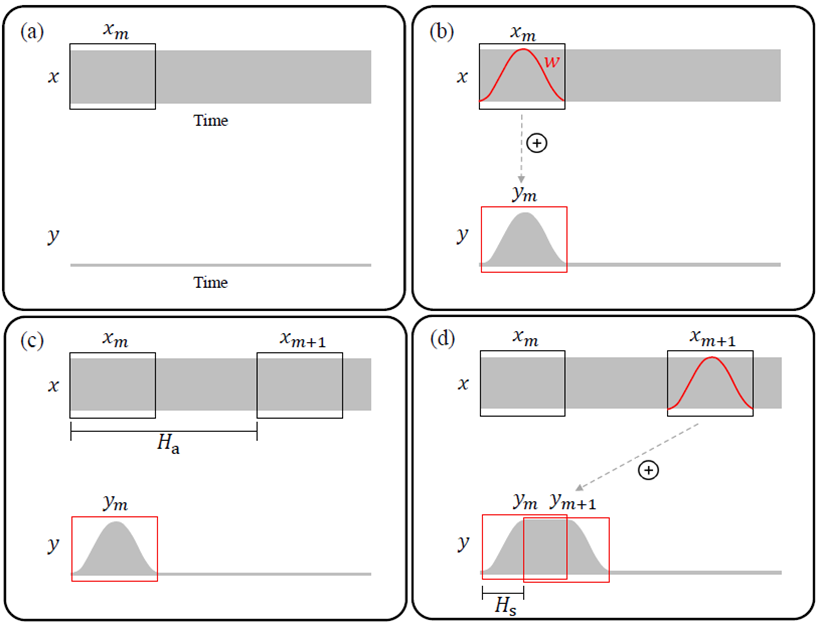

# 音效算法

## Time Scale Modification (TSM)

使用傅里叶变换的方法对音频信号进行变速时，会伴随着音调的改变。为了保持音调不变，需要采用“变速不变调”，即Time Scale Modification (TSM)算法。

### Overlap-add (OLA)

    

如图所示，OLA的算法可以分为以上四步，通常采用Analysis-Synthesis处理框架，通过对信号进行加窗，并根据伸缩系数$H_s$选择下一个合成帧，加窗相加合成变速后的信号，通常合成窗的hop size $H_s$为窗长的一半。

    

但OLA算法的缺点也很明显，如上图所示，对于周期信号存在一定的破坏性。

### WSOLA (Waveform Similarity Overlap-add)

    

WSOLA算法在OLA算法的基础上，引入了tolerance的概念，在$Δ_{max}$的区间范围内，选择一个与$\widetilde{x}_{m}$相似度最大的窗作为下一帧合成帧，可以缓解OLA算法中带来的周期信号破坏负面效果。

    

但WSOLA并不能根治周期的破坏性这一缺陷，此外，对于OLA, WSOLA这一类算法，有可能存在出现“叠音”的情况，如上图所示，尤其是在慢速播放的情况下。

### Phase Vocoder

# 参考文献
[1] Driedger J, Müller M. [A review of time-scale modification of music signals](https://www.mdpi.com/2076-3417/6/2/57)[J]. Applied Sciences, 2016, 6(2): 57.